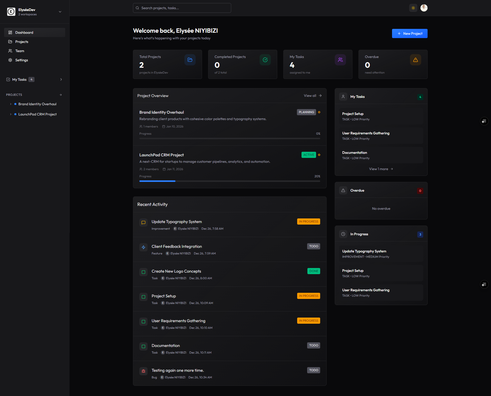
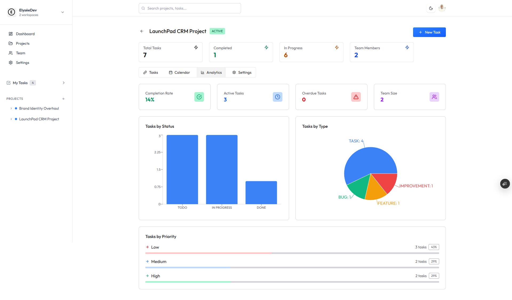

<div align="center">

<h1><sup>💼</sup>Project Management Platform<sub>📊</sub> </h1>

Modern Full-Stack Project Management with Real-time Collaboration & Automated Notifications


**Built with cutting-edge technologies for modern team collaboration:**


## 🚀 Live Demo

Visit the 👉 [_LINK 🔗_](https://project-management-three-dusky.vercel.app)

| Dashboard View              | Project Management       |
| --------------------------- | ------------------------ |
|  |  |

</div>

---

## 📋 Table of Contents

- [✨ Features](#-features)
- [🛠 Tech Stack](#-tech-stack)
- [🏗️ Project Structure](#-project-structure)
- [⚡ Getting Started](#-getting-started)
  - [Prerequisites](#prerequisites)
  - [Backend Setup](#backend-setup)
  - [Frontend Setup](#frontend-setup)
  - [Environment Variables](#environment-variables)
- [🗄️ Database Schema](#-database-schema)
- [📡 API Endpoints](#-api-endpoints)
- [🔄 Background Jobs](#-background-jobs)
- [🎨 UI/UX Features](#-uiux-features)
- [🚀 Deployment](#-deployment)
- [📊 Future Enhancements](#-future-enhancements)
- [📝 License](#-license)
- [🤝 Contributing](#-contributing)

---

## ✨ Features

### 🏢 Organization Management

- Create multiple organizations
- Invite and manage team members
- Role-based access control
- Workspace isolation

### 📋 Project & Task Management

- Create and manage projects
- Create tasks with assignees and due dates
- Task prioritization and categorization
- Real-time project updates

### 🔔 Smart Notifications

- Email notifications for new task assignments
- Due date reminder emails
- Real-time in-app notifications
- Background job processing with Inngest

### 👥 Team Collaboration

- Invite team members via email
- Assign tasks to team members
- Track team activity and performance
- Project analytics and insights

---

## 🛠 Tech Stack

### Frontend


### Backend


### Services & APIs


---

## 🏗️ Project Structure

```groovy
project-management/
├── 📁 client/                    # React Frontend
│   ├── src/
│   │   ├── app/
│   │   │   ├── store.js         # Redux store configuration
│   │   │   └── themeSlice.js    # Theme management
│   │   ├── assets/              # Static assets
│   │   ├── components/          # Reusable React components
│   │   ├── configs/
│   │   ├── features/            # Feature slices
│   │   ├── pages/               # Application pages
│   │   ├── App.jsx              # Main App component
│   │   ├── index.css            # Global styles
│   │   └── main.jsx             # Entry point
│   ├── .env                     # Environment variables
│   ├── package.json             # Frontend dependencies
│   └── vite.config.js           # Vite configuration
│
├── 📁 server/                   # Express Backend
│   ├── configs/
│   ├── controllers/             # Route controllers
│   ├── inngest/                 # Background jobs
│   ├── middlewares/             # Express middlewares
│   ├── prisma/                  # Database schema
│   ├── routes/                  # API routes
│   ├── .env                     # Server environment variables
│   ├── package.json             # Backend dependencies
│   └── server.js               # Server entry point
│
├── LICENSE                      # ISC License
└── README.md                   # This file
```

### 📦 Package Scripts

**Frontend (Client):**

```json
{
  "scripts": {
    "dev": "vite",
    "build": "vite build",
    "lint": "eslint .",
    "preview": "vite preview"
  }
}
```

**Backend (Server):**

```json
{
  "scripts": {
    "postinstall": "npx prisma generate",
    "server": "nodemon server.js",
    "start": "prisma generate && node server.js"
  }
}
```

---

## ⚡ Getting Started

### Prerequisites

- Node.js (v18 or higher)
- PostgreSQL (or Neon PostgreSQL account)
- Clerk account for authentication
- Inngest account for background jobs

### Clone the repository:

```console
git clone https://github.com/elyse502/project-management.git
cd project-management
```

### Backend Setup

```console
cd server
npm install
cp .env.example .env
# Configure your environment variables
npm run server
```

### Frontend Setup

```console
cd client
npm install
cp .env.example .env
# Configure your environment variables
npm run dev
```

### Environment Variables

**Server (.env):**

```env
DATABASE_URL="neon_postgresql_connection_string"
CLERK_SECRET_KEY="your_clerk_secret_key"
INNGEST_EVENT_KEY="your_inngest_event_key"
EMAIL_HOST="smtp.gmail.com"
EMAIL_PORT=587
EMAIL_USER="your_email@gmail.com"
EMAIL_PASS="your_app_password"
```

**Client (.env):**

```env
VITE_CLERK_PUBLISHABLE_KEY="your_clerk_publishable_key"
VITE_API_URL="http://localhost:5000/api"
```

---

## 🗄️ Database Schema

The application uses **Neon PostgreSQL** with Prisma ORM. Core models include:

- **User** - Managed by Clerk authentication
- **Organization** - Workspace/company entities
- **Member** - Organization team members
- **Project** - Projects within organizations
- **Task** - Individual tasks with assignees
- **Comment** - Task/project comments
- **Notification** - User notifications

---

## 📡 API Endpoints

### Authentication (Clerk)

- User signup/login via Clerk
- Organization-based access control
- Protected API routes with middleware

### Workspaces

- `GET /api/workspaces` - List user's workspaces
- `POST /api/workspaces` - Create new workspace
- `POST /api/workspaces/:id/invite` - Invite members

### Projects

- `GET /api/projects` - List organization projects
- `POST /api/projects` - Create new project
- `GET /api/projects/:id` - Get project details
- `PUT /api/projects/:id` - Update project
- `DELETE /api/projects/:id` - Delete project

### Tasks

- `GET /api/tasks` - List project tasks
- `POST /api/tasks` - Create new task
- `PUT /api/tasks/:id` - Update task status
- `POST /api/tasks/:id/assign` - Assign task to member

---

## 🔄 Background Jobs

The application uses **Inngest** for handling background jobs:

1. **Email Notifications** - Send task assignment emails
2. **Due Date Reminders** - Send reminder emails 24h before due date
3. **Clerk Webhooks** - Handle user/organization sync events
4. **Analytics Processing** - Process project statistics

---

## 🎨 UI/UX Features

- **Responsive Design** - Works on all devices
- **Dark/Light Mode** - Theme toggle support
- **Real-time Updates** - WebSocket connections for live updates
- **Drag & Drop** - Task status updates
- **Charts & Analytics** - Project insights with Recharts
- **Calendar View** - Task scheduling and due dates

---

## 🚀 Deployment

### Vercel Deployment

Both client and server are configured for Vercel deployment with `vercel.json` configuration files.

### Database

- Uses **Neon PostgreSQL** for serverless database
- Connection pooling for optimal performance
- Automatic backups and scaling

---

## 📊 Future Enhancements

- [ ] File attachments for tasks
- [ ] Time tracking for tasks
- [ ] Gantt chart visualization
- [ ] Mobile application
- [ ] Integrations (Slack, GitHub, etc.)
- [ ] Advanced reporting and exports

---

## 📝 License

This project is licensed under the **MIT License**. See the [LICENSE](https://github.com/elyse502/project-management/blob/main/LICENSE) file for details.

---

## 🤝 Contributing

Contributions are welcome! Please feel free to submit a Pull Request.

1. Fork the repository
2. Create your feature branch (`git checkout -b feature/AmazingFeature`)
3. Commit your changes (`git commit -m 'Add some AmazingFeature'`)
4. Push to the branch (`git push origin feature/AmazingFeature`)
5. Open a Pull Request

---

## Support

For support, email _elyseniyibizi502@gmail.com_ or create an issue in the GitHub repository.

---

## 📞 Contact

For any questions or support, please contact:

- [**NIYIBIZI Elysée**](https://linktr.ee/niyibizi_elysee)👨🏿‍💻 | [Github](https://github.com/elyse502) | [Linkedin](https://www.linkedin.com/in/niyibizi-elys%C3%A9e/) | [Twitter](https://twitter.com/Niyibizi_Elyse).
- **Email**: <elyseniyibizi502@gmail.com>

[](https://www.linkedin.com/in/niyibizi-elys%C3%A9e/) [](https://twitter.com/Niyibizi_Elyse) [](https://github.com/elyse502)

---

<div align="center">

**Built with ❤️ using modern web technologies 🚀**

_Streamline your team's workflow with powerful project management tools_

[⬆ Back to Top](#-table-of-contents)

</div><br />
